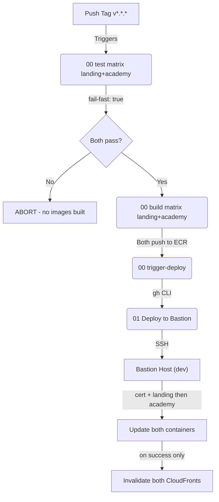

# 🤖 CI/CD - Agevega.com

Este directorio contiene los workflows de GitHub Actions que automatizan el ciclo de vida de la aplicación, desde el build hasta el despliegue en producción.

## 🔄 Pipeline de Despliegue

La automatización sigue un flujo encadenado ("Chain Reaction") para garantizar que solo las imágenes construidas exitosamente se desplieguen.

### 1. Build & Push (`00-generate-docker-image.yml`)

- **Trigger**: Push de un tag semántico (e.g., `v1.0.2`).
- **Estructura**: 3 jobs encadenados, todos con matrix `[landing, academy]` y `fail-fast: true`.
  1. **`test`**: `bun install` + `bun run build` + `bun run test` por sitio. Cualquier fallo aborta antes de construir imagen.
  2. **`build`** (`needs: test`): construye la imagen Docker (multi-arch `linux/amd64,linux/arm64`) desde `sites/${{ matrix.site }}/` y la publica en su ECR (`agevegacom-landing` / `agevegacom-academy`) con tags `${{ ref_name }}` y `latest`. Landing recibe build-args `PUBLIC_APP_VERSION` + `PUBLIC_API_URL` (de SSM); academy no necesita build-args.
  3. **`trigger-deploy`** (`needs: build`): dispara `01-deploy-bastion.yml` vía `gh workflow run`. Solo se ejecuta si TODA la matrix de build terminó OK — atomicidad entre sitios.
- **Concurrency**: `deploy-${{ github.ref }}` repo-wide. Tags distintos pueden buildearse en paralelo (claves distintas); el mismo tag pusheado dos veces se serializa.

### 2. Deploy to Bastion (`01-deploy-bastion.yml`)

- **Trigger**: `workflow_dispatch` (invocado por workflow 00 al final, o manualmente con `image_tag` para rollback).
- **Acción** (single job, steps secuenciales — fallo en uno aborta los siguientes):
  1. **Discovery**: lee de SSM ambos ECR repos, ambos CloudFront IDs, y la DNS del bastion.
  2. **Setup SSH** + **scp** de los 3 scripts (`00_generate_cert.sh`, `01_deploy_landing.sh`, `01_deploy_academy.sh`) + `chmod +x`.
  3. **Cert**: ejecuta `00_generate_cert.sh` (cert multi-SAN cubriendo landing + academy via `--dns-route53` + `--expand` + `--keep-until-expiring`, idempotente).
  4. **Login ECR** en el bastion.
  5. **Deploy landing** (script `01_deploy_landing.sh`, contenedor `landing`, host:443).
  6. **Deploy academy** (script `01_deploy_academy.sh`, contenedor `academy`, host:8443) — si landing falla, no corre.
  7. **CloudFront invalidation landing** (con `if: success()` — si algún deploy falló, no invalida).
  8. **CloudFront invalidation academy** (mismo).
- **Concurrency**: `deploy-bastion` (sin discriminador), serializa todos los deploys al mismo bastion para evitar race en docker daemon, certs, e invalidaciones.

### 3. Deploy to Production (`02-deploy-production.yml`)

- **Trigger**: Ejecución **manual** tras verificar en desarrollo. Se le indica la versión que queremos desplegar.
- **Acción**:
  1. **SSM Parameter**: Actualiza la versión de la imagen en Parameter Store (`/agevegacom/production/image_tag`).
  2. **Instance Refresh**: Inicia la rotación de instancias en el Auto Scaling Group.
     - **Síncrono**: El pipeline espera y monitorea el estado del refresco.
     - Si falla o se cancela, el pipeline se detiene.
     - Solo continúa cuando el 100% de las instancias están saludables.
  3. **Invalidate Cache**: Purga la caché de CloudFront (Producción) para asegurar que los usuarios reciban la nueva versión de landing inmediatamente.

### 4. Test Sites (`03-test-sites.yml`)

- **Trigger**: Push a `master` o Pull Request que toque `sites/**` o configs de estilo.
- **Acción**: Ejecuta `bun install --frozen-lockfile && bun run build && bun run test` para cada site (matrix: landing, academy).
- **Propósito**: Gate informativo — verifica que ambos sites compilan y pasan tests tras cualquier cambio.

## 🔐 Secretos Requeridos

Para que los pipelines funcionen, el repositorio debe tener configurados los siguientes **Secrets** y **Variables**:

| Nombre                  | Tipo     | Descripción                                               |
| :---------------------- | :------- | :-------------------------------------------------------- |
| `AWS_ACCESS_KEY_ID`     | Secret   | Credenciales de AWS IAM User (User: terraform).           |
| `AWS_SECRET_ACCESS_KEY` | Secret   | Credenciales de AWS IAM User (User: terraform).           |
| `EC2_SSH_KEY`           | Secret   | Clave privada ssh para acceder al Bastion.                |
| `AWS_REGION`            | Variable | Región de AWS (e.g., `eu-south-2`).                       |
| (ECR repo names)        | SSM      | Leídos en runtime: `/agevegacom/02-shared-resources/01-ecr-repositories/ecr-repository-{landing,academy}`. |

## 🛠 Ejecución Manual

Aunque el flujo es automático, puedes lanzar un despliegue manual desde la pestaña **Actions** de GitHub si necesitas:

- Redesplegar una versión antigua (Rollback).
- Forzar una actualización sin crear un tag nuevo.

Selecciona el workflow **"01 Deploy to Bastion"**, pulsa "Run workflow" e introduce el tag de la imagen manual (e.g., `v1.0.1`).
