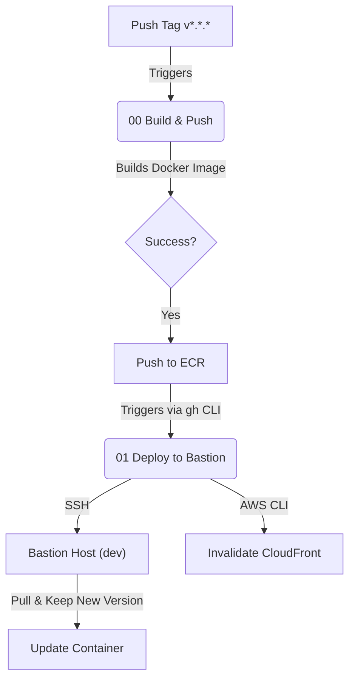

# 🤖 CI/CD - Agevega.com

Este directorio contiene los workflows de GitHub Actions que automatizan el ciclo de vida de la aplicación, desde el build hasta el despliegue en producción.

## 🔄 Pipeline de Despliegue

La automatización sigue un flujo encadenado ("Chain Reaction") para garantizar que solo las imágenes construidas exitosamente se desplieguen.

### 1. Build & Push (`00-generate-docker-image.yml`)

- **Trigger**: Push de un tag semántico (e.g., `v1.0.2`).
- **Acción**:
  1. Construye la imagen Docker del frontend (multi-arch).
  2. Publica la imagen en **AWS ECR** con el tag de versión y `latest`.
  3. **Dispara automáticamente** el siguiente workflow (`01-deploy-bastion`).

### 2. Deploy to Bastion (`01-deploy-bastion.yml`)

- **Trigger**: `workflow_dispatch` (generalmente invocado por el workflow anterior).
- **Acción**:
  1. **Dynamic Discovery**: Busca la IP pública del "Bastion Host" mediante tags de AWS (`Name=bastion-host`).
  2. **Remote Execution**: Conecta por SSH usando la clave privada almacenada en secretos.
  3. **Deploy**: Ejecuta el script `scripts/01_deploy_frontend.sh` en el servidor para rotar contenedores.
  4. **Cache Purge**: Invalida la caché de CloudFront para el entorno de desarrollo (`dev.agevega.com`).

### 3. Deploy to Production (`02-deploy-production.yml`)

- **Trigger**: Ejecución **manual** tras verificar en desarrollo. Se le indica la versión que queremos desplegar.
- **Acción**:
  1. **SSM Parameter**: Actualiza la versión de la imagen en Parameter Store (`/agevegacom/production/image_tag`).
  2. **Instance Refresh**: Inicia la rotación de instancias en el Auto Scaling Group.
     - **Síncrono**: El pipeline espera y monitorea el estado del refresco.
     - Si falla o se cancela, el pipeline se detiene.
     - Solo continúa cuando el 100% de las instancias están saludables.
  3. **Invalidate Cache**: Purga la caché de CloudFront (Producción) para asegurar que los usuarios reciban el nuevo frontend inmediatamente.

## 🔐 Secretos Requeridos

Para que los pipelines funcionen, el repositorio debe tener configurados los siguientes **Secrets** y **Variables**:

| Nombre                  | Tipo     | Descripción                                               |
| :---------------------- | :------- | :-------------------------------------------------------- |
| `AWS_ACCESS_KEY_ID`     | Secret   | Credenciales de AWS IAM User (User: terraform).           |
| `AWS_SECRET_ACCESS_KEY` | Secret   | Credenciales de AWS IAM User (User: terraform).           |
| `EC2_SSH_KEY`           | Secret   | Clave privada ssh para acceder al Bastion.                |
| `AWS_REGION`            | Variable | Región de AWS (e.g., `eu-south-2`).                       |
| `ECR_REPOSITORY`        | Variable | Nombre del repositorio ECR (e.g., `agevegacom-frontend`). |

## 🛠 Ejecución Manual

Aunque el flujo es automático, puedes lanzar un despliegue manual desde la pestaña **Actions** de GitHub si necesitas:

- Redesplegar una versión antigua (Rollback).
- Forzar una actualización sin crear un tag nuevo.

Selecciona el workflow **"01 Deploy to Bastion"**, pulsa "Run workflow" e introduce el tag de la imagen manual (e.g., `v1.0.1`).
