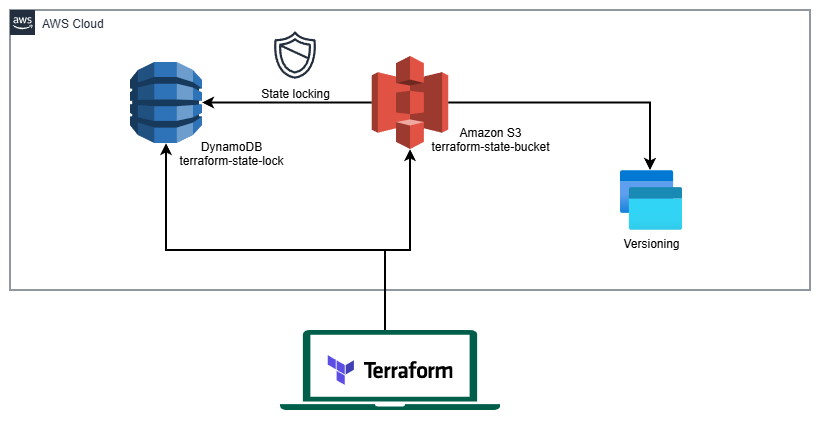

# 🛠️ 00-setup

Este módulo gestiona el **Bootstrap** inicial de la infraestructura y las herramientas de gobierno y auditoría. Establece los cimientos necesarios para que Terraform opere de forma segura.



---

## 🏛️ Arquitectura

Este módulo prepara el entorno de AWS para ser gestionado por Terraform y establece controles de costes y seguridad.

- **Terraform Backend Remoto en S3**: Almacenamiento centralizado y bloqueo de estado para evitar condiciones de carrera.
- **Auditoría**: Registro de actividad de API (CloudTrail) e inventario de recursos (Config).
- **Control Financiero**: Alertas de presupuesto para evitar sorpresas en la facturación.

---

## 📂 Componentes (Submódulos)

### 1. [00-tf-backend](./00-tf-backend)

- **Función**: Bootstrap de IaC.
- **Recursos**:
  - `S3 Bucket`: Para guardar el archivo `terraform.tfstate` de cada submódulo.
  - `DynamoDB Table`: Para el bloqueo de estado (Locking).

### 2. [01-audit-logs](./01-audit-logs)

- **Función**: Compliance y Seguridad.
- **Recursos**:
  - `CloudTrail`: Trazas de auditoría de todas las llamadas a la API de AWS.
  - `AWS Config`: Historial de configuración y cambios en recursos.
  - `S3 Buckets`: Almacenamiento de logs.

### 3. [02-budgets](./02-budgets)

- **Función**: FinOps / Control de Costes.
- **Recursos**:
  - `AWS Budgets`: Presupuestos mensuales ($10) y diarios ($1) con alertas escalonadas por email.

---

## 🚀 Guía de Despliegue

Este es el módulo "Huevo y la Gallina". El setup inicial se hace con estado local y luego se migra al remoto.

### 1. Bootstrap (00-tf-backend)

```bash
cd 00-tf-backend
terraform init
terraform apply
# Una vez creado, descomentar el bloque 'backend "s3"' en backend.tf y migrar:
terraform init -migrate-state
```

### 2. Auditoría (01-audit-logs)

**Opción A: Grabación Continua (Recomendado/Default)**

```bash
cd 01-audit-logs
terraform init
terraform apply
```

**Opción B: Grabación Diaria (Ahorro de Costes)**

```bash
cd 01-audit-logs
terraform init
terraform apply -var="config_recording_frequency=DAILY"
```

**Opción C: Desactivar AWS Config**

```bash
cd 01-audit-logs
terraform init
terraform apply -var="enable_config=false"
```

### 3. Presupuestos (02-budgets)

```bash
cd 02-budgets
terraform init
terraform apply
```

---

## 🔧 Variables Clave

| Submódulo | Variable                     | Descripción                       | Valor por Defecto            |
| :-------- | :--------------------------- | :-------------------------------- | :--------------------------- |
| `00`      | `bucket_name`                | Nombre del bucket de estado       | `agevegacom-terraform-state` |
| `00`      | `dynamodb_table_name`        | Tabla para State Locking          | `terraform-state-lock`       |
| `01`      | `enable_config`              | Habilitar/deshabilitar AWS Config | `true`                       |
| `01`      | `config_recording_frequency` | Frecuencia de grabación de Config | `CONTINUOUS`                 |
| `02`      | `monthly_budget_limit`       | Límite de gasto mensual ($)       | `10`                         |
| `02`      | `daily_budget_limit`         | Límite de gasto diario ($)        | `1`                          |
| Global    | `region`                     | Región principal de despliegue    | `eu-south-2` (Spain)         |

---

## ⚡ Optimización y Costes

- **Budgets y Alertas**: El uso de presupuestos granulares (diario/mensual) permite una detección temprana de anomalías de coste, evitando facturas inesperadas (Cost Control).
- **S3 Lifecycle**: Los logs de auditoría tienen ciclos de vida configurados para archivarse/borrarse automáticamente y reducir costes de almacenamiento.
