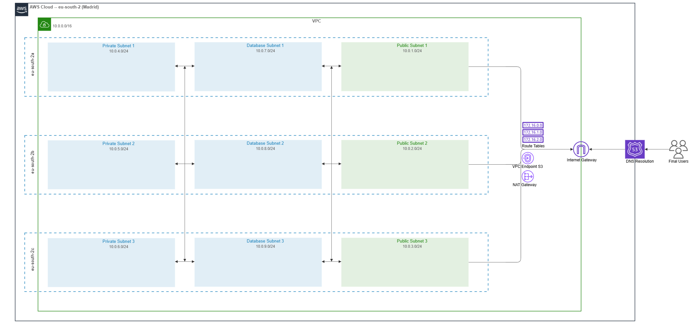

# 01-networking

Este módulo crea la **red troncal (VPC)** para la infraestructura de `agevegacom`. Diseñada con una arquitectura de 3 capas para máxima seguridad y escalabilidad, manteniendo los costes al mínimo en entornos de laboratorio.

El estado se guarda en `00-backend-S3` y el backend se configura en `backend.tf`.



---

## 🏛️ Arquitectura de Red

La red se despliega en la región **`eu-south-2` (España)** distribuida en **3 Zonas de Disponibilidad (AZs)** para alta disponibilidad.

### Estrategia de Subredes (3-Tier)

1.  **Public Tier (`10.0.1.0/24`, `...2.0`, `...3.0`)**

    - **Acceso:** Salida directa a Internet (IGW).
    - **Uso:** Load Balancers (ALB), Bastion Hosts, recursos públicos.
    - **Auto-asignación IP:** Activada.

2.  **Private Tier (`10.0.4.0/24`, `...5.0`, `...6.0`)**

    - **Acceso:** Sin salida a Internet por defecto (para ahorrar costes).
    - **Uso:** Servidores de aplicaciones (ECS/EC2), lógica de negocio.
    - **Conectividad:** Requiere NAT Gateway para salir a Internet (ver nota de costes).

3.  **Database Tier (`10.0.7.0/24`, `...8.0`, `...9.0`)**
    - **Acceso:** Estrictamente aislado. Sin ruta a Internet.
    - **Uso:** RDS, ElastiCache, bases de datos.

---

## 💰 Optimización de Costes (Lab Mode)

> 💡 **NAT Gateway Pospuesto (~33 €/mes AHORRO)**
>
> Por defecto, este módulo **NO despliega el NAT Gateway**.
>
> - **Consecuencia**: Las subredes privadas no tienen acceso a Internet (no pueden descargar parches/paquetes directamente).
> - **Solución**: Los recursos están definidos pero comentados en `vpc.tf`. Descoméntalos solo cuando sea estrictamente necesario.

Incluye **VPC Endpoints** (S3) gratuitos para que las instancias privadas puedan acceder a buckets sin salir a Internet.

---

## 🚀 Despliegue

```bash
cd infra/terraform/01-networking
terraform init
terraform apply
```

### Prerrequisito

Debe haberse ejecutado previamente el módulo `00-setup` para tener el backend de estado listo.

---

## 🔧 Variables Clave

| Variable             | Descripción         | Valor por defecto         |
| :------------------- | :------------------ | :------------------------ |
| `vpc_cidr`           | Rango IP principal  | `10.0.0.0/16`             |
| `resource_prefix`    | Prefijo de recursos | `agevegacom`              |
| `availability_zones` | Alta disponibilidad | `eu-south-2a`, `2b`, `2c` |

---

## 📤 Outputs Importantes

Al finalizar, el módulo exporta IDs críticos para otros módulos (como el Bastion o EKS/ECS):

- `vpc_id`
- `subnet_public_ids`
- `subnet_private_ids`
- `subnet_db_ids`
