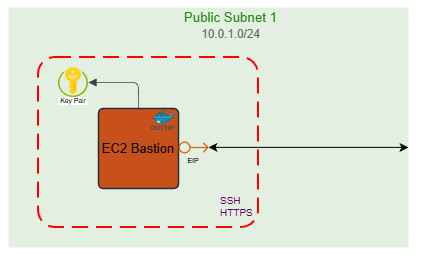

# 🛡️ 04-bastion-host

Este módulo despliega el punto de entrada administrativo y la distribución de contenido por defecto de la infraestructura o servidor de desarrollo (dev). Combina seguridad perimetral y acceso remoto seguro.



---

## 🏛️ Arquitectura

- **Bastion Host**: Instancia EC2 mínima (`t4g.nano`) en subred pública para tunelización SSH hacia recursos privados.
- **CDN Global**: CloudFront actúa como frontal para servir contenido estático (assets) y enrutar tráfico dinámico (si fuera necesario).
- **Seguridad**:
  - **WAF**: Protege la distribución CloudFront contra ataques web comunes.
  - **Security Groups**: Lista blanca estricta para acceso SSH.

---

## 📂 Componentes (Submódulos)

### 1. [00-security](./00-security)

- **Función**: Firewall de red.
- **Recursos**: Security Groups para Bastion (SSH 22, HTTP 80, HTTPS 443).

### 2. [01-eip](./01-eip)

- **Función**: IP Estática.
- **Recursos**: Elastic IP para asegurar persistencia de DNS en el Bastion.

### 3. [02-ec2-instance](./02-ec2-instance)

- **Función**: Cómputo.
- **Recursos**: Instancia EC2 Amazon Linux 2023.

### 4. [03-waf](./03-waf)

- **Función**: Seguridad de Aplicación.
- **Recursos**: Web ACL (AWS Managed Rules) en `us-east-1`.

### 5. [04-cloudfront](./04-cloudfront)

- **Función**: Entrega de contenido.
- **Recursos**: Distribución con orígenes múltiples (S3 y EC2).

---

## 🚀 Guía de Despliegue

El orden es **estricto** debido a las dependencias en cadena.

### 1. Grupos de Seguridad

```bash
cd 00-security
terraform init
terraform apply
```

### 2. Elastic IP

```bash
cd ../01-eip
terraform init
terraform apply
```

### 3. WAF (Debe existir antes de CloudFront)

```bash
cd ../03-waf
terraform init
terraform apply
```

### 4. Instancia Bastion

```bash
cd ../02-ec2-instance
terraform init
terraform apply
```

### 5. CloudFront

```bash
cd ../04-cloudfront
terraform init
terraform apply
```

---

## 🔧 Variables Clave

| Variable                  | Descripción             | Valor por Defecto  |
| :------------------------ | :---------------------- | :----------------- |
| `allowed_ssh_cidr_blocks` | IPs permitidas para SSH | `["0.0.0.0/0"]`    |
| `instance_type`           | Tipo de instancia EC2   | `t4g.nano` (ARM64) |
| `environment`             | Tag de entorno          | `dev`              |

---

## ⚡ Optimización y Costes

- **Instancia Nano ARM**: Uso de `t4g.nano` que ofrece el coste más bajo posible para una instancia EC2 on-demand, suficiente para un bastion host.
- **Http Proxy**: CloudFront está configurado para cachear contenido estático de S3 agresivamente, reduciendo peticiones al origen y costes de transferencia de datos.
