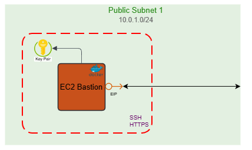

# 🛡️ 04-bastion-host

Este módulo despliega el punto de entrada administrativo y la distribución de contenido por defecto de la infraestructura o servidor de desarrollo (dev). Combina seguridad perimetral y acceso remoto seguro.



---

## 🏛️ Arquitectura

- **Bastion Host**: Instancia EC2 mínima (`t4g.nano`) en subred pública para tunelización SSH hacia recursos privados.
- **CDN Global**: CloudFront actúa como frontal para el contenido estatico del bastion host sirviendo este como entorno de desarrollo.
- **Seguridad**:
  - **WAF**: Protege la distribución CloudFront contra ataques web comunes.
  - **Security Groups**: Whitelist para acceso SSH.

---

## 📂 Componentes (Submódulos)

### 1. [00-security](./00-security)

- **Función**: Firewall de red.
- **Recursos**: Security Groups para Bastion (SSH 22, HTTP 80, HTTPS 443).

### 2. [01-eip](./01-eip)

- **Función**: IP Estática.
- **Recursos**: Elastic IP para asegurar persistencia de DNS en el Bastion.

### 3. [02-ec2-instance](./02-ec2-instance)

- **Función**: Cómputo.
- **Recursos**: Instancia EC2 Amazon Linux 2023.

### 4. [03-waf](./03-waf)

- **Función**: Protección Web.
- **Recursos**: Web ACL (AWS Managed Rules) en `us-east-1`.

### 5. [04-cloudfront](./04-cloudfront)

- **Función**: CDN Global.
- **Recursos**: Distribución con orígenes múltiples (S3 y EC2).

### 6. [05-dns-record](./05-dns-record)

- **Función**: Registro DNS Final.
- **Recursos**: Registro `A` (Alias) en Route53 (`dev.agevega.com`) apuntando a CloudFront.

---

## 🚀 Guía de Despliegue

El orden es **estricto** debido a las dependencias en cadena.

### 1. Grupos de Seguridad

```bash
cd 00-security
terraform init
terraform apply
```

### 2. Elastic IP

```bash
cd ../01-eip
terraform init
terraform apply
```

### 3. Instancia Bastion

```bash
cd ../02-ec2-instance
terraform init
terraform apply
```

### 4. WAF

```bash
cd ../03-waf
terraform init
terraform apply
```

### 5. CloudFront

```bash
cd ../04-cloudfront
terraform init
terraform apply
```

### 6. DNS Record

```bash
cd ../05-dns-record
terraform init
terraform apply
```

## 🛑 Gestión de EIP

Por defecto, la instancia no tiene IP elástica (EIP) y usa su Public DNS. Si necesitas una IP fija:

1.  **Desplegar módulo EIP**:
    ```bash
    cd 01-eip
    terraform apply
    ```
2.  **Activar en Instancia**:
    ```bash
    cd ../02-ec2-instance
    terraform apply -var="enable_eip=true"
    ```

Para desactivar la EIP y volver a usar Public DNS:

1.  **Desactivar en Instancia**:
    ```bash
    cd 02-ec2-instance
    terraform apply -var="enable_eip=false"
    ```
2.  **Destruir EIP** (Opcional, para ahorrar costes):
    ```bash
    cd ../01-eip
    terraform destroy
    ```

## 🛑 Gestión del WAF

Para destruir o desvincular el WAF sin errores:

1. **Desvincular en CloudFront**:
   ```bash
   cd 04-cloudfront
   terraform apply -var="enable_waf=false"
   ```
2. **Destruir WAF**:
   ```bash
   cd ../03-waf
   terraform destroy
   ```

---

## 🔧 Variables Clave

| Submódulo | Variable                  | Descripción             | Valor por Defecto  |
| :-------- | :------------------------ | :---------------------- | :----------------- |
| `00`      | `allowed_ssh_cidr_blocks` | IPs permitidas para SSH | `["0.0.0.0/0"]`    |
| `02`      | `instance_type`           | Tipo de instancia EC2   | `t4g.nano` (ARM64) |
| `05`      | `domain_name`             | Dominio raíz            | `agevega.com`      |

---

## ⚡ Optimización y Costes

- **Instancia Nano ARM**: Uso de `t4g.nano` que ofrece el coste más bajo posible para una instancia EC2 on-demand, suficiente para un bastion host.
- **Http Proxy**: CloudFront está configurado para cachear contenido estático de S3 agresivamente, reduciendo peticiones al origen y costes de transferencia de datos.
